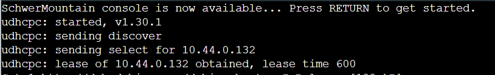
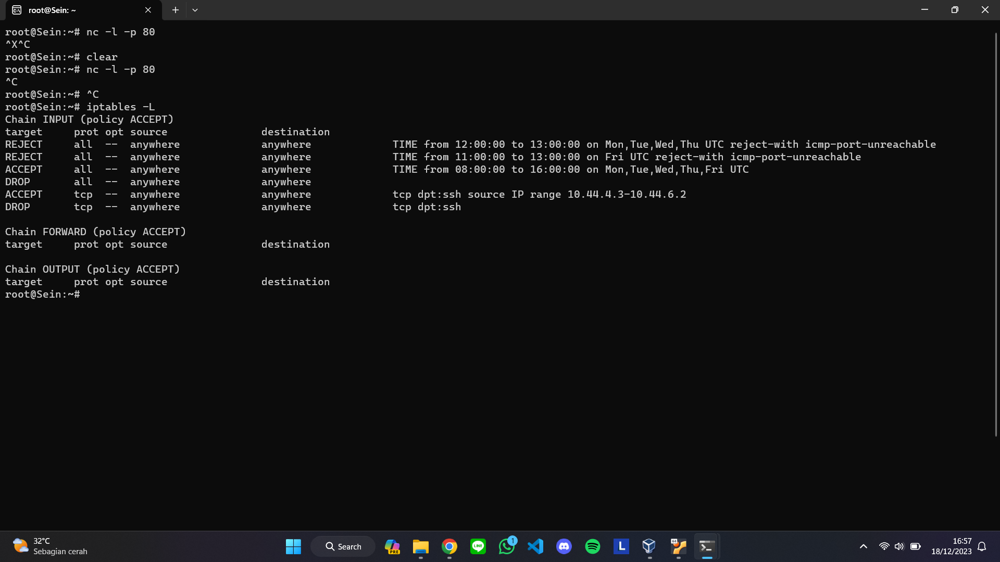
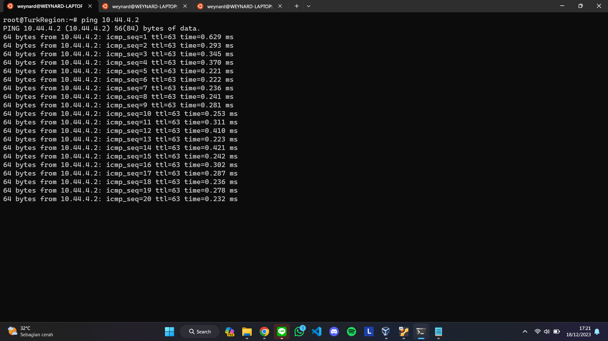
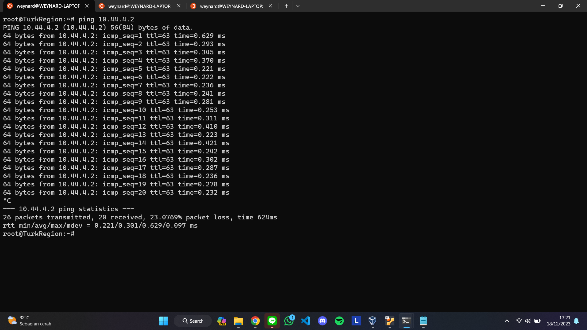

# Jarkom-Modul-5-E15-2023

<table>
    <tr>
        <th colspan=2> Kelompok E15 </th>
    </tr>
    <tr>
        <th>NRP</th>
        <th>Nama Anggota</th>
    </tr>
    <tr>
        <td>5025211014</td>
        <td>Alexander Weynard Samsico</td>
    </tr>
  <tr>
        <td>5025211121</td>
        <td>Frederick Yonatan Susanto</td>
    </tr>
</table>

## A. Tugas Pertama

### Pembuatan Topologi

Wilayah North Area


Keterangan:

- Richter adalah DNS Server
- Revolte adalah DHCP Server
- Sein dan Stark adalah Web Server
- Jumlah Host pada SchwerMountain adalah 64
- Jumlah Host pada LaubHills adalah 255
- Jumlah Host pada TurkRegion adalah 1022
- Jumlah Host pada GrobeForest adalah 512

## B. Untuk menghitung rute-rute yang diperlukan, gunakan perhitungan dengan metode VLSM. Buat juga pohonnya, dan lingkari subnet yang dilewati.

Untuk menentukan IP address and routing untuk topologi, kita akan menggunakan VLSM untuk pencarian subnet.

**Perhitungan Rute:**


**Lingkaran subnet:**


**Pohon VLSM:**


**Sehingga didapatkan pembagian IP:**


## C. Kemudian buatlah rute sesuai dengan pembagian IP yang kalian lakukan

Dengan range NID dan Broadcast Address, kita dapat melakukan konfigurasi node pada GNS3 sebagai berikut

#### Aura

```
# DHCP config for eth0
auto eth0
iface eth0 inet dhcp

# Static config for eth1
auto eth1
iface eth1 inet static
	address 10.44.0.1
	netmask 255.255.255.252

# Static config for eth2
auto eth2
iface eth2 inet static
	address 10.44.0.5
	netmask 255.255.255.252
```

#### Heiter

```
# Static config for eth0
auto eth0
iface eth0 inet static
	address 10.44.0.2
	netmask 255.255.255.252
	gateway 10.44.0.1

# Static config for eth1
auto eth1
iface eth1 inet static
	address 10.44.8.1
	netmask 255.255.248.0

# Static config for eth2
auto eth2
iface eth2 inet static
	address 10.44.4.1
	netmask 255.255.252.0
```

#### TurkRegion

```
# DHCP config for eth0
auto eth0
iface eth0 inet dhcp
```

#### Sein

```
# Static config for eth0
auto eth0
iface eth0 inet static
	address 10.44.4.2
	netmask 255.255.252.0
	gateway 10.44.4.1
```

#### GrobeForest

```
# DHCP config for eth0
auto eth0
iface eth0 inet dhcp
```

#### Frieren

```
# Static config for eth0
auto eth0
iface eth0 inet static
        address 10.44.0.6
	netmask 255.255.255.252
	gateway 10.44.0.5

# Static config for eth1
auto eth1
iface eth1 inet static
	address 10.44.0.9
	netmask 255.255.255.252

# Static config for eth2
auto eth2
iface eth2 inet static
	address 10.44.0.13
	netmask 255.255.255.252
```

#### Stark

```
# Static config for eth0
auto eth0
iface eth0 inet static
	address 10.44.0.10
	netmask 255.255.255.252
	gateway 10.44.0.9
```

#### Himmel

```
# Static config for eth0
auto eth0
iface eth0 inet static
	address 10.44.0.14
	netmask 255.255.255.252
	gateway 10.44.0.13

# Static config for eth1
auto eth1
iface eth1 inet static
	address 10.44.2.1
	netmask 255.255.254.0

# Static config for eth2
auto eth2
iface eth2 inet static
	address 10.44.0.129
	netmask 255.255.255.128
```

#### LaubHills

```
# DHCP config for eth0
auto eth0
iface eth0 inet dhcp
```

#### SchwerMountain

```
# DHCP config for eth0
auto eth0
iface eth0 inet dhcp
```

#### Fern

```
# Static config for eth0
auto eth0
iface eth0 inet static
	address 10.44.0.130
	netmask 255.255.255.128
	gateway 10.44.0.129


# Static config for eth1
auto eth1
iface eth1 inet static
	address 10.44.0.17
	netmask 255.255.255.252

# Static config for eth2
auto eth2
iface eth2 inet static
	address 10.44.0.21
    netmask 255.255.255.252
```

#### Richter

```
# Static config for eth0
auto eth0
iface eth0 inet static
	address 10.44.0.18
	netmask 255.255.255.252
	gateway 10.44.0.17
```

#### Revolte

```
# Static config for eth0
auto eth0
iface eth0 inet static
	address 10.44.0.22
	netmask 255.255.255.252
	gateway 10.44.0.21
```

Kemudian untuk konfigurasi routingnya (agar dapat mengenal subnets) sebagai berikut

#### Aura

```
route add -net 10.44.4.0 netmask 255.255.252.0 gw 10.44.0.2
route add -net 10.44.8.0 netmask 255.255.248.0 gw 10.44.0.2
route add -net 10.44.0.8 netmask 255.255.255.252 gw 10.44.0.6
route add -net 10.44.0.12 netmask 255.255.255.252 gw 10.44.0.6
route add -net 10.44.2.0 netmask 255.255.254.0 gw 10.44.0.6
route add -net 10.44.0.128 netmask 255.255.255.128 gw 10.44.0.6
route add -net 10.44.0.16 netmask 255.255.255.252 gw 10.44.0.6
route add -net 10.44.0.20 netmask 255.255.255.252 gw 10.44.0.6
```

#### Heiter

```
route add -net 0.0.0.0 netmask 0.0.0.0 gw 10.44.0.1
```

#### Frieren

```
route add -net 0.0.0.0 netmask 0.0.0.0 gw 10.44.0.5
route add -net 10.44.2.0 netmask 255.255.254.0 gw 10.44.0.14
route add -net 10.44.0.128 netmask 255.255.255.128 gw 10.44.0.14
route add -net 10.44.0.16 netmask 255.255.255.252 gw 10.44.0.14
route add -net 10.44.0.20 netmask 255.255.255.252 gw 10.44.0.14
```

#### Himmel

```
route add -net 0.0.0.0 netmask 0.0.0.0 gw 10.44.0.13
route add -net 10.44.0.16 netmask 255.255.255.252 gw 10.44.0.130
route add -net 10.44.0.20 netmask 255.255.255.252 gw 10.44.0.130
```

#### Fern

```
route add -net 0.0.0.0 netmask 0.0.0.0 gw 10.44.0.129
```

## D, Tugas berikutnya adalah memberikan ip pada subnet SchwerMountain, LaubHills, TurkRegion, dan GrobeForest menggunakan bantuan DHCP.

Karena 4 client itu menggunakan dhcp, maka kita perlu mengkonfigurasi melalui DHCP dari Revolte

Aturlah subnet dhcp pada /etc/dhcp/dhcpd.conf sebagai berikut dengan range dari pembagian IP sebelumnya

```
echo "
subnet 10.44.0.20 netmask 255.255.255.252 {

}


subnet 10.44.4.0 netmask 255.255.252.0 {
        range 10.44.4.3 10.44.6.2;
        option routers 10.44.4.1;
        option broadcast-address 10.44.7.255;
        option domain-name-servers 10.44.0.18;
        default-lease-time 600;
        max-lease-time 7200;
}

subnet 10.44.8.0 netmask 255.255.248.0 {
        range 10.44.8.2 10.44.11.255;
        option routers 10.44.8.1;
        option broadcast-address 10.44.15.255;
        option domain-name-servers 10.44.0.18;
        default-lease-time 600;
        max-lease-time 7200;
}

subnet 10.44.2.0 netmask 255.255.254.0 {
        range 10.44.2.2 10.44.3.0;
        option routers 10.44.2.1;
        option broadcast-address 10.44.3.255;
        option domain-name-servers 10.44.0.18;
        default-lease-time 600;
        max-lease-time 7200;
}

subnet 10.44.0.128 netmask 255.255.255.128 {
        range 10.44.0.131 10.44.0.194;
        option routers 10.44.0.129;
        option broadcast-address 10.44.0.255;
        option domain-name-servers 10.44.0.18;
        default-lease-time 600;
        max-lease-time 7200;
}

"  > /etc/dhcp/dhcpd.conf
```

Penjelasan:

1. Untuk routing dari Revolte
2. Untuk subnet GrobeForest
3. Untuk subnet TurkRegion
4. Untuk subnet LaubHills
5. Untuk subnet SchwerMountain

Dan tidak lupa untuk mengatur interface sebagai berikut (eth0):

```
echo '
# Defaults for isc-dhcp-server (sourced by /etc/init.d/isc-dhcp-server)

# Path to dhcpd'\''s config file (default: /etc/dhcp/dhcpd.conf).
#DHCPDv4_CONF=/etc/dhcp/dhcpd.conf
#DHCPDv6_CONF=/etc/dhcp/dhcpd6.conf

# Path to dhcpd'\''s PID file (default: /var/run/dhcpd.pid).
#DHCPDv4_PID=/var/run/dhcpd.pid
#DHCPDv6_PID=/var/run/dhcpd6.pid

# Additional options to start dhcpd with.
#       Don'\''t use options -cf or -pf here; use DHCPD_CONF/ DHCPD_PID instead
#OPTIONS=""

# On what interfaces should the DHCP server (dhcpd) serve DHCP requests?
#       Separate multiple interfaces with spaces, e.g. "eth0 eth1".
INTERFACES="eth0"
' > /etc/default/isc-dhcp-server
```

Jangan lupa untuk melakukan `service isc-dhcp-server restart`

Kemudian agar Clients mendapatkan IPnya, kita perlu mengatur router di dekat mereka sebagai relay yaitu Fern, Himmel, dan Heiter.

#### Fern, Himmel, dan Heiter

```
echo 'nameserver 192.168.122.1' > /etc/resolv.conf
apt-get update
apt-get install isc-dhcp-relay -y
service isc-dhcp-relay start
```

Kemudian melakukan konfigurasi untuk semua port mereka sebagai berikut

```
echo '
# Defaults for isc-dhcp-relay initscript
# sourced by /etc/init.d/isc-dhcp-relay
# installed at /etc/default/isc-dhcp-relay by the maintainer scripts

#
# This is a POSIX shell fragment
#

# What servers should the DHCP relay forward requests to?
SERVERS="10.44.0.22"

# On what interfaces should the DHCP relay (dhrelay) serve DHCP requests?
INTERFACES="eth0 eth1 eth2"

# Additional options that are passed to the DHCP relay daemon?
OPTIONS=""
' > /etc/default/isc-dhcp-relay
echo 'net.ipv4.ip_forward=1' > /etc/sysctl.conf
service isc-dhcp-relay restart
```

melakukan restart pada node clients, dan siap digunakan

### LaubHills


### GrobeForest


### TurkRegion


### SchwerMountain



Terakhir agar memanfaatkan DNS nameserver pada `/etc/resolv.conf` mereka, kita tambahkan konfigurasi pada Ritcher sebagai berikut:

```
apt-get update
apt-get install bind9 -y
echo 'options {
        directory "/var/cache/bind";

        forwarders {
                   192.168.122.1;
          };
        //dnssec-validation auto;
        allow-query{ any; };
        listen-on-v6 { any; };
};' > /etc/bind/named.conf.options

service bind9 restart
```

## Penjelasan: forward dari NAT melalui IP DNS

## 6. Lalu, karena ternyata terdapat beberapa waktu di mana network administrator dari WebServer tidak bisa stand by, sehingga perlu ditambahkan rule bahwa akses pada hari Senin - Kamis pada jam 12.00 - 13.00 dilarang (istirahat maksi cuy) dan akses di hari Jumat pada jam 11.00 - 13.00 juga dilarang (maklum, Jumatan rek).

Melanjutkan dari soal sebelumnya, soal ini meminta untuk menambahkan rule waktu untuk akses pada Webserver. Lakukan `iptables -F` terlebih dahulu kemudian menambahkan iptables dari nomor 4 dan 5 (optional)

```
iptables -A INPUT -m time --timestart 12:00 --timestop 13:00 --weekdays Mon,Tue,Wed,Thu -j REJECT
iptables -A INPUT -m time --timestart 11:00 --timestop 13:00 --weekdays Fri -j REJECT
```

Penjelasan:

- Menggunakan `REJECT` karena "dilarang"
- Akses mulai dari jam 12:00 sampai 13:00 pada hari Senin-Kamis akan ditolak
- Akses mulai dari jam 11:00 sampai 13:00 pada hari Jumat akan ditolak

### Testing:

- Mengubah tanggal terlebih dahulu
- Lakukan `nc` pada IP Webserver pada client


## 7. Karena terdapat 2 WebServer, kalian diminta agar setiap client yang mengakses Sein dengan Port 80 akan didistribusikan secara bergantian pada Sein dan Stark secara berurutan dan request dari client yang mengakses Stark dengan port 443 akan didistribusikan secara bergantian pada Sein dan Stark secara berurutan.

Untuk menyelesaikan masalah ini, kita dapat mengatur arah routingnya melalui `PREROUTING`. Pada chain `PREROUTING`, dijalankan DNAT (Destination NAT) yaitu ketika anda mengubah alamat tujuan dari paket pertama dengan kata lain anda merubah ke mana komunikasi terjadi. Konfigurasi ini perlu diletakan pada router dekat Webserver yang akan diolah IPnya yaitu Heiter dan Frieren.

```
iptables -t nat -A PREROUTING -p tcp --dport 80 -d 10.44.4.2 -m statistic --mode nth --every 2 --packet 0 -j DNAT --to-destination 10.44.0.10:80

iptables -t nat -A PREROUTING -p tcp --dport 443 -d 10.44.0.10 -m statistic --mode nth --every 2 --packet 0 -j DNAT --to-destination 10.44.4.2:443
```

Penjelasan:

- menggunakan PREROUTING berarti menggunakan NAT table
- `-p tcp --dport 80` untuk protokol port 80
- `-p tcp --dport 443` untuk protokol port 443
- `-d 10.44.4.2` / `-d 10.44.0.10` untuk yang mau ke IP Webserver
- `-m statistic --mode nth --every 2 --packet 0` berarti setiap pemanggilan kelipatan 2, rule akan ditrigger
- `-j DNAT --to-destination 10.44.0.10:80` / `-j DNAT --to-destination 10.44.4.2:443` jika ditrigger, maka akan diarahkan pada tujuan tersebut

### Testing:

#### Webserver

Pada node ini, kita bisa jalankan

```
while true; do nc -l -p [port] -c 'echo $HOSTNAME'; done
```

Penjelasan: setiap kali client / node yang melakukan `nc` pada IP dan port tersebut akan dilemparkan dia melakukan `nc` pada nama Webserver yang mana. [port] dapat diubah ke 80 atau 443.




#### Client / node

lakukan\

- **nc 10.44.4.2 80**


- **nc 10.44.0.10 443**


## 8. Karena berbeda koalisi politik, maka subnet dengan masyarakat yang berada pada Revolte dilarang keras mengakses WebServer hingga masa pencoblosan pemilu kepala suku 2024 berakhir. Masa pemilu (hingga pemungutan dan penghitungan suara selesai) kepala suku bersamaan dengan masa pemilu Presiden dan Wakil Presiden Indonesia 2024.

Kita diminta agar subnet Revolte tidak bisa mengakses WebServer selama masa pemilu yaitu dari tanggal 14 Februari 2024 sampai 27 Juni 2024.

```
iptables -I INPUT 1 -s 10.44.0.20/30 -m time --datestart 2024-02-14 --datestop 2024-06-27 -j REJECT
iptables -I INPUT 2 -s 10.44.0.20/30 -j ACCEPT
```

Penjelasan:

- `-I INPUT i` masuk pada chain INPUT pada urutan ke-i
- `-s 10.44.0.20/30` karena dilakukan spesifik subnet, maka kita spesifikasi NID/NetMask
- `-m time --datestart 2024-02-14 --datestop 2024-06-27` mulai dari tanggal 14 Februari 2024 sampai 27 Juni 2024
- untuk dari tanggal 14 Februari 2024 sampai 27 Juni 2024 akan ditolak aksesnya
- Jika tidak memenuhi rule atas, akan akan di-ACCEPT

### Testing

- Ubah tanggal terlebih dahulu
- Lakukan `nc` pada Webserver dari Revolte


## 9. Sadar akan adanya potensial saling serang antar kubu politik, maka WebServer harus dapat secara otomatis memblokir alamat IP yang melakukan scanning port dalam jumlah banyak (maksimal 20 scan port) di dalam selang waktu 10 menit.

(clue: test dengan nmap)

Soal ini kita diminta untuk melakukan block pada IP yang melakukan scan 20 kali dalam waktu 10 menit. Kita perlu menambahkan konfigurasi iptables pada Webserver sebagai berikut

```
iptables -N scanning_port # membuat chain baru
iptables -A INPUT -m recent --name scanning_port --update --seconds 600 --hitcount 20 -j DROP # drop scan port
iptables -A FORWARD -m recent --name scanning_port --update --seconds 600 --hitcount 20 -j DROP # drop scan port

iptables -A INPUT -m recent --name scanning_port --set -j ACCEPT
iptables -A FORWARD -m recent --name scanning_port --set -j ACCEPT
```

Penjelasan:

- Membuat chain baru untuk mencatat scan port (scanning_port)
- `-m recent --name scanning_port --update --seconds 600 --hitcount 20 -j DROP` menggunakan ruleset `recent` untuk block scan port, dimulai dari nama chain yang dibuat sebelumnya, `--update` mengeccek apakah source address sudah tercatat dalam list atau belum, mengecek dengan hitcount berjumlah 20 dalam waktu 600 detik. Jika tercapai maka akan didrop. Rule ini dilakukan untuk INPUT dan FORWARD
- `-m recent --name scanning_port --set -j ACCEPT ` dilakukan `--set -j ACCEPT` untuk menambahkan source address pada list scanning_port untuk diperiksa (dilakukan untuk INPUT dan FORWARD)

### Testing

Kita akan mencoba implementasi pada Sein


- Kita bisa menggunakan `nmap` karena bisa mengatur pengiriman paket dengan selang waktu tertentu

```sh
#!/bin/bash
web_server="10.44.4.2" # ip WebServer Sein

for ((i=1; i<=30; i++)); do
        echo $i
        nmap -p 80 -T4 -sS "$web_server" # nmap port 80 pada timing T4 (max-rtt-timeout = 1250 ms, bisa diatur menjadi T0, T1, dst)
done
```


- atau kita cukup menggunakan `ping` untuk melihat apakah ping akan berhenti pada jumlah 20





## 10. Karena kepala suku ingin tau paket apa saja yang di-drop, maka di setiap node server dan router ditambahkan logging paket yang di-drop dengan standard syslog level.

Soal ini meminta untuk mendaftarkan packet apa saja yang didrop pada logging.

Pertama, mari kita menyalakan `syslog`

```
echo "
kern.debug                   -/var/log/syslog" >> /etc/rsyslog.conf

/etc/init.d/rsyslog restart
```

Penjelasan:

- tambahkan konfigurasi `kern.debug` agar setiap log debug akan masuk dalam syslog yang kita buat
- Lakukan restart pada rsyslog agar terbuat syslognya

Kemudian, kita membuat iptables untuk mencatat log sebagai berikut:

```
iptables -N LOGGING
iptables -A INPUT -j LOGGING
iptables -A FORWARD -j LOGGING
iptables -A OUTPUT -j LOGGING
iptables -A LOGGING -j LOG --log-prefix "PacketsDropped: " --log-level debug
iptables -A LOGGING -j DROP
```

Penjelasan:

- Kita membuat chain baru: LOGGING
- Kemudian INPUT, FORWARD, dan OUTPUT memanggil LOGGING
- Pada chain LOGGING, dia akan melakukan perintah LOG untuk membuat log dengan `--log-level` debug dan `--log-prefix` berisi 'PacketsDropped: ' sebagai header.
- Kemudian pada LOGGING lakukan DROP setelah mendaftar

### Testing

#### Sein (Server)

- rule LOGGING terdaftar


- syslog


#### Heiter (Router)


## Kendala

1. Saat melakukan testing nomor 7, `nc` dari client kadang agak lag terhadap while loop di Web Server (terkadang muncul, terkadang tidak). Akan tetapi secara hasil, sesuai yang diharapkan.
2. Pada nomor 10, belum menemukan cara tepat untuk mendaftar log pada syslog.
